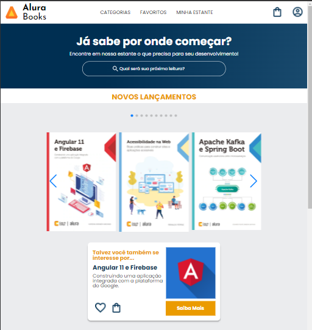
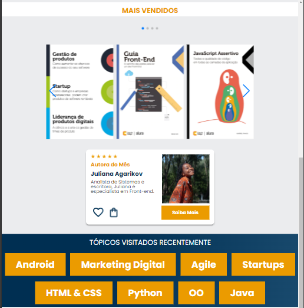
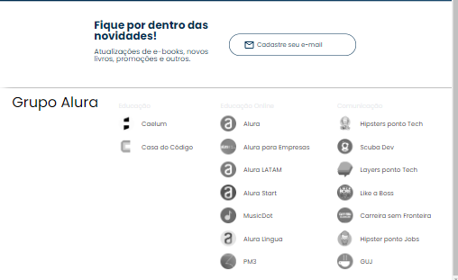
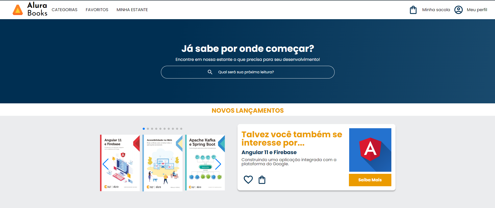
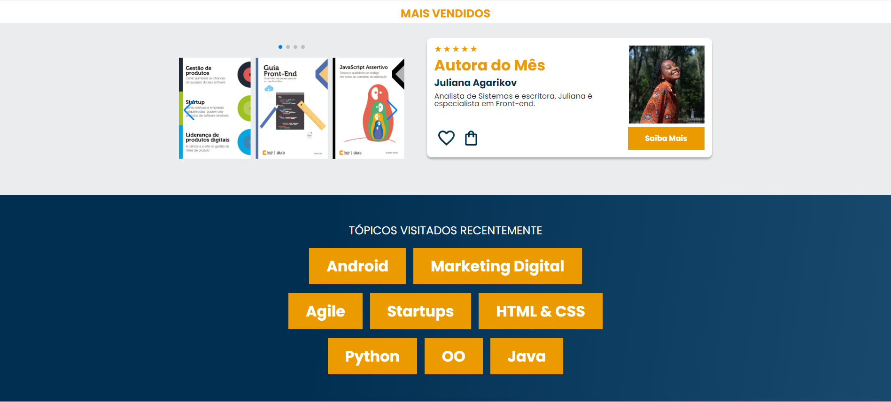
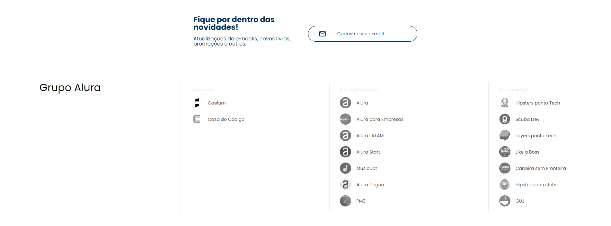

# Alura-Book-Mobile
 
This is a solution to the [Alura - HMTL e CSS: Responsividade com mobile-first](https://cursos.alura.com.br/course/html-css-responsividade-mobile-first). Alura Front-end school help you improve your coding skills by building realistic projects. 

## Table of contents

- [Overview](#overview)
  - [The challenge](#the-challenge)
  - [Screenshot](#screenshot)
  - [Links](#links)
- [My process](#my-process)
  - [Built with](#built-with)
  - [What I learned](#what-i-learned)
  - [Continued development](#continued-development)
  - [Useful resources](#useful-resources)
- [Author](#author)
- [Acknowledgments](#acknowledgments)

## Overview

This is the final project for Alura Books in its responsive version.

### The challenge

Users should be able to:

Make three layouts for Alura Books using media query and mobile-first. Using figma to visualize the final product.

### Screenshot
#### Mobile

#### Tablet

#### Desktop

### Links

- Solution URL: [GitHub](https://github.com/ViniCellist/Alura-Book-Mobile)
- Live Site URL: [Vercel](https://alura-book-mobile.vercel.app/)

## My process

Started with HTML structure, added styles with CSS and used CDN for scrollbar in books

### Built with

- Semantic HTML5 markup
- CSS custom properties
    - Flexbox
    - CSS Vars
- Mobile-first workflow
- Swiper API for pagination

### What I learned

I learned one of the best way to create a website using mobile-first, it was so much better to code in this way.

### Continued development

I know for sure that this projects opened my mind to see webpage creation in a whole new perspective

### Useful resources

- [HTML 5](https://developer.mozilla.org/en-US/docs/Web) - HTML documentation.
- [CSS3](https://developer.mozilla.org/en-US/docs/Web/CSS) - CSS3 documentation.
- [Swiper](https://swiperjs.com/swiper-api#pagination) - for pagination

## Author

- Website - [Vercel](https://vercel.com/vinicellists-projects)
- GitHub - [Projects](https://github.com/ViniCellist)
- Frontend Mentor - [Profile](https://www.frontendmentor.io/profile/ViniCellist)
- LinkedIn - [Professional](hhttps://www.linkedin.com/in/vinicius-de-souza-duarte-57937b192/)
- Instagram - [Personal](https://www.instagram.com/vinicius_duartesd/)

## Acknowledgments

Honored mention goes to my mentor and teacher [Monica Hillman](https://github.com/MonicaHillman)!